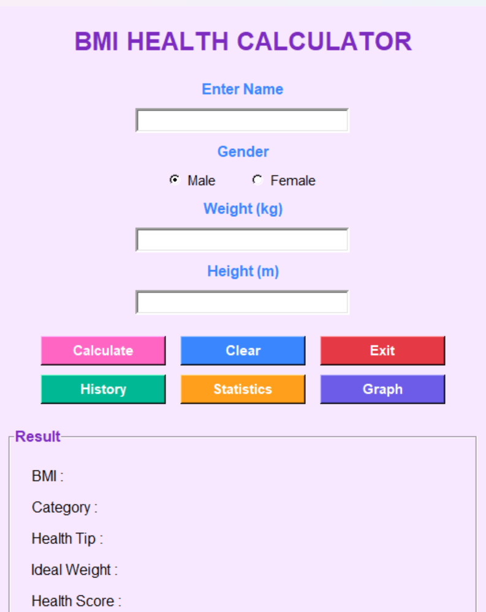
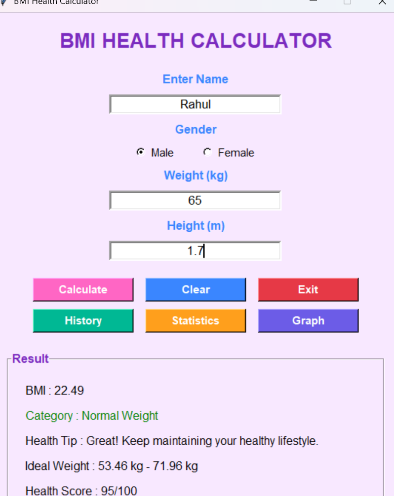
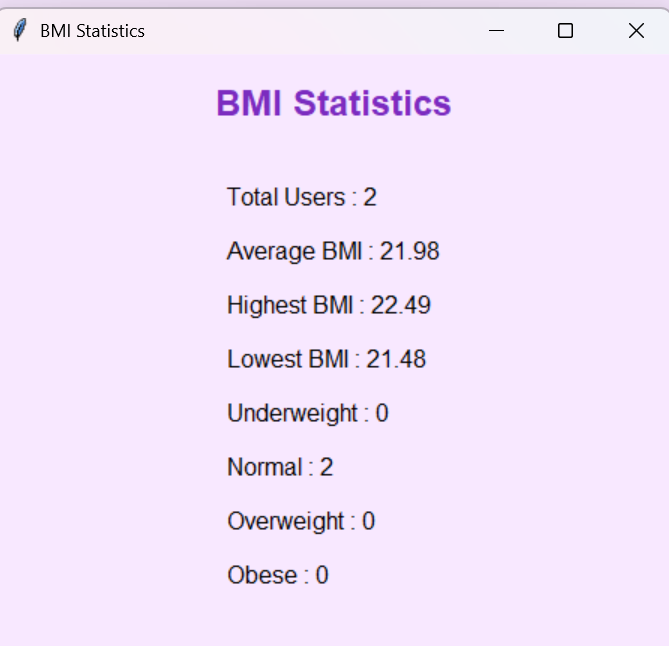
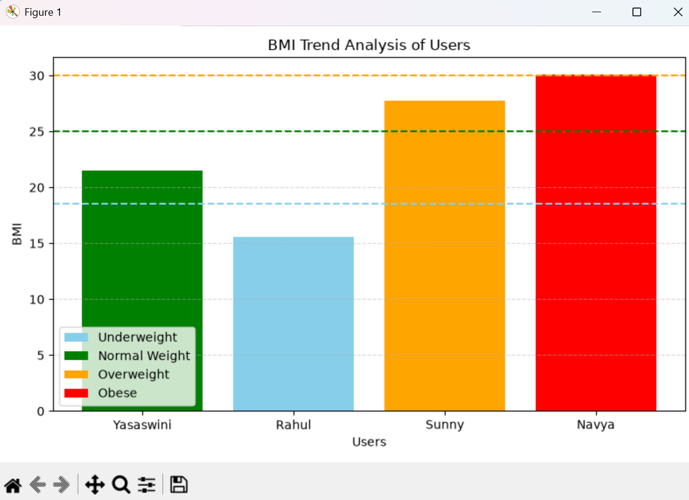
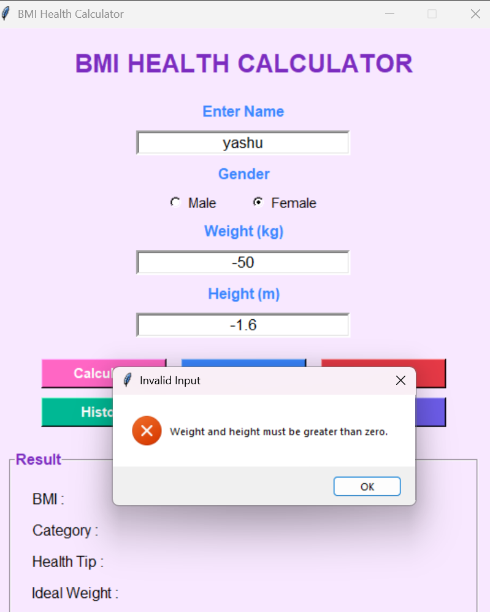

# OIBSIP_Python_Task1_BMI_Calculator

##  Project Overview

The BMI Health Calculator is a Python GUI application developed using Tkinter. It helps users calculate their Body Mass Index (BMI), determine their health category, and receive health suggestions based on the calculated BMI.

The application also stores user records in a JSON file, displays previous BMI records, provides statistical analysis, and visualizes BMI data using graphs.

## Features

- User-friendly Tkinter GUI
- BMI calculation using weight and height
- BMI category classification
- Health tips based on BMI
- Ideal weight calculation
- Health score display
- Name and gender input
- Input validation and error handling
- Save user data in JSON format
- View BMI history
- Display BMI statistics
- BMI trend graph using Matplotlib
- Clear and Exit options

## Technologies Used

- Python
- Tkinter
- JSON
- Matplotlib
- Datetime
- OS Module

## Project Structure

OIBSIP_Python_Task1_BMI_Calculator
│
├── YeraballiYasaswini_task1_bmi_calculator.py
├── bmi_data.json
├── README.md
├── Screenshot1.png
├── Screenshot2.png
├── Screenshot3.png
├── Screenshot4.png
└── Screenshot5.png

## How to Run

1. Install Python 3.x
2. Install Matplotlib

pip install matplotlib

3. Run the project
python YeraballiYasaswini_task1_bmi_calculator.py

## How It Works

1. Enter your name.
2. Select gender.
3. Enter weight (kg).
4. Enter height (m).
5. Click **Calculate**.
6. View:
   - BMI
   - Health Category
   - Health Tip
   - Ideal Weight
   - Health Score
7. Save records automatically.
8. Use:
   - History
   - Statistics
   - Graph
   buttons to view stored data.

## Validation

- Name accepts only alphabets.
- Weight must be greater than zero.
- Height must be greater than zero.
- Invalid inputs are handled using message boxes.

## Output

The application displays:

- BMI
- BMI Category
- Health Tip
- Ideal Weight
- Health Score

It also stores every calculation inside **bmi_data.json**.

## Screenshots

### Main Window

### BMI result

### Statistics

### BMI Graph

### inavlid input

## Future Enhancements

- Export reports as PDF
- Search previous records
- Delete history
- Edit existing records
- Pie chart visualization
- User login system

