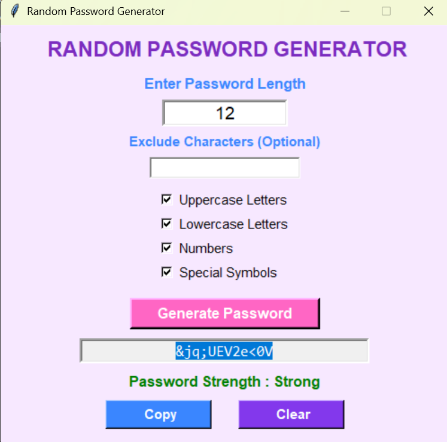
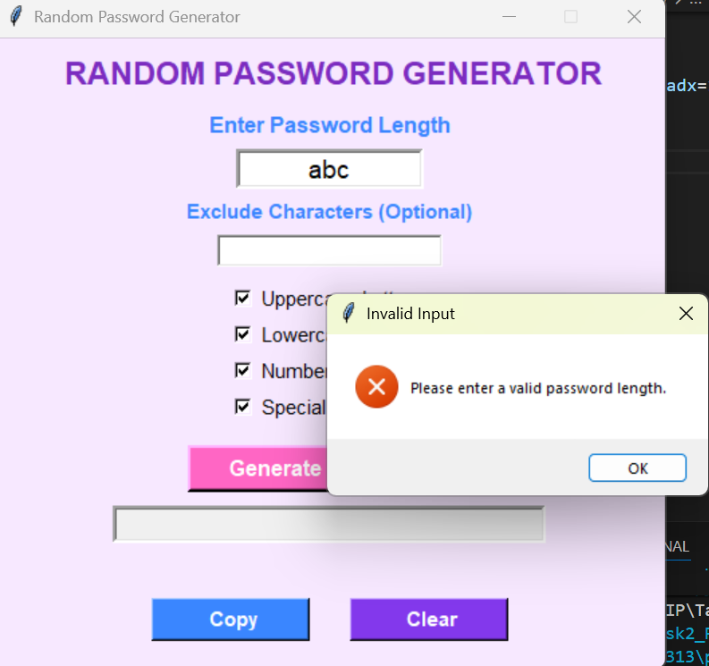
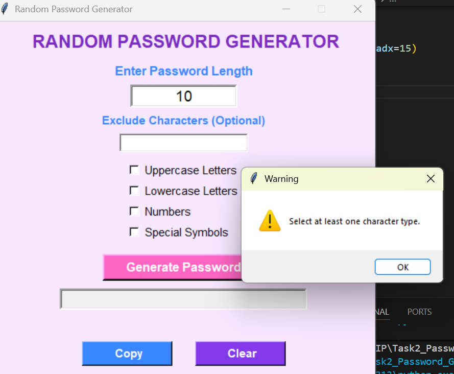
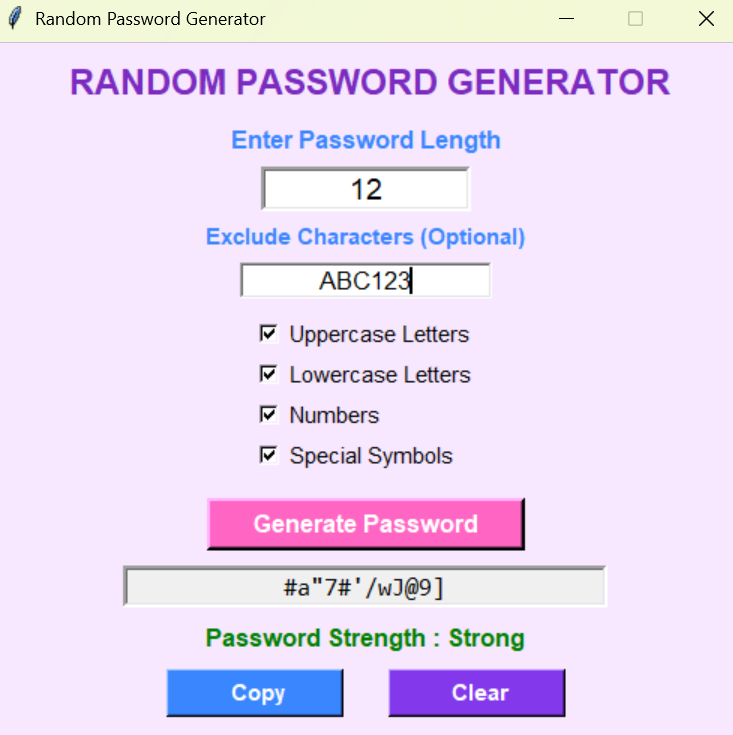

# Random Password Generator

## Project Description

The Random Password Generator is a desktop application developed using Python and the Tkinter library. It allows users to generate secure and customizable passwords based on their preferences.

Users can specify the password length, choose the types of characters to include (uppercase letters, lowercase letters, numbers, and special symbols), and exclude specific characters if required. The application also evaluates the strength of the generated password and provides an option to copy it directly to the clipboard.

## Features

* Graphical User Interface (GUI) developed using Tkinter
* Generate random passwords of any valid length
* Select uppercase letters
* Select lowercase letters
* Select numbers
* Select special symbols
* Option to exclude specific characters
* Password strength indicator (Weak, Medium, Strong)
* Copy generated password to the clipboard
* Clear all input fields
* Input validation and error handling
* Generates passwords by following basic security rules

## Technologies Used

* Python 3
* Tkinter
* Random Module
* String Module

## How to Run the Project

1. Open the project folder in Visual Studio Code or any Python IDE.
2. Run the file:

YeraballiYasaswini_task2_PasswordGenerator.py

3. Enter the desired password length.
4. Optionally enter characters to exclude.
5. Select the character types you want to include.
6. Click the **Generate Password** button.
7. Copy the generated password if required using the **Copy** button.
8. you can also clearall the fields by using **clear** button.

## Security Rules

The application follows the following security rules:

* Includes at least one character from every selected character category.
* Supports uppercase letters, lowercase letters, numbers, and special symbols.
* Allows users to exclude unwanted characters.
* Evaluates password strength based on password length and selected character categories.

## Test Cases

**Generate a password with valid inputs:** A password is generated successfully.
**Enter 0 or a negative password length:** An error message is displayed.
**Enter letters instead of a number:** An invalid input message is displayed.
**Leave all character options unchecked:** A warning message is displayed.
**Copy without generating a password:** A warning message is displayed.
**Click the Clear button:** All input fields are cleared and the default options are restored.
**Exclude specific characters:** The generated password does not contain the excluded characters.
**Select multiple character types:** The generated password includes at least one character from each selected category.

## Project Structure

Task2_Password_Generator
│
├-YeraballiYasaswini_task2_PasswordGenerator.py
├-README.md
├-Testcases.doc

## Future Improvements

* Add an option to save generated passwords.
* Generate multiple passwords at the same time.
* Add a dark mode interface.
* Export passwords to a text file.
* Provide additional password customization options.

## Output Screenshots

### Strong Password Generation

---
### Invalid Input

---
### no check boxes selected

### Exclude Characters

