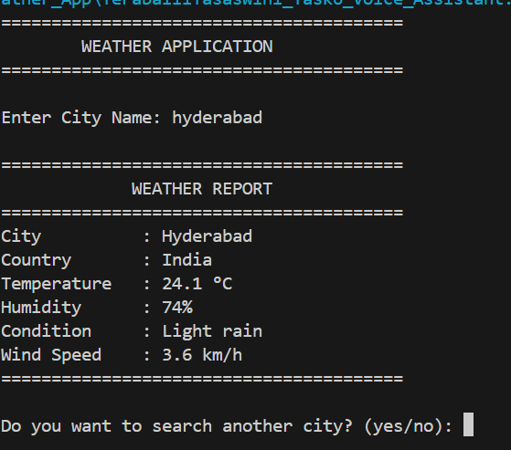
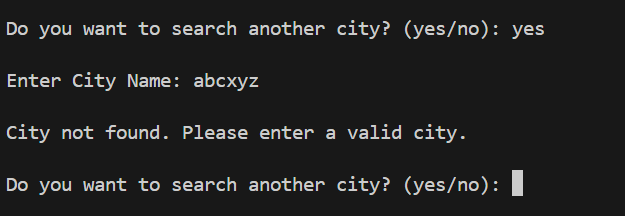
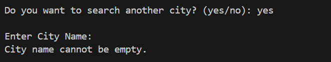

# Basic Weather App

## Project Description

The Basic Weather App is a command-line Python application that allows users to check the current weather of any city using a weather API. The user enters a city name, and the application displays the current weather details such as temperature, humidity, weather condition, country, and wind speed.

The application also validates user input, handles invalid city names, and allows users to search for multiple cities without restarting the program.

---

## Features

- Command-line based application
- Search weather by city name
- Displays current temperature
- Displays humidity
- Displays weather condition
- Displays country name
- Displays wind speed
- Handles invalid city names
- Handles empty user input
- Allows multiple searches in a single run
- Uses WeatherAPI to fetch live weather data

---

## Technologies Used

- Python 3
- Requests Library
- WeatherAPI

---

## Requirements

Before running the project, install the required library:


py -m pip install requests


Create a free account at **https://www.weatherapi.com/** and generate your API key.

Replace:

```python
api_key = "YOUR_API_KEY"
```

with your own API key.

---

## How to Run

1. Open the project in Visual Studio Code or any Python IDE.
2. Install the required library.
3. Replace the API key with your own.
4. Run the Python file.
5. Enter the city name.
6. View the current weather details.
7. Choose whether to search another city or exit the application.

---

## Test Cases

- Valid city name: Displays the current weather information successfully.
- Another valid city: Displays weather information for the selected city.
- Invalid city name: Displays an appropriate error message.
- Empty input: Prompts the user to enter a valid city name.
- Search again: Allows the user to search another city without restarting.
- Exit application: Closes the application after displaying a thank-you message.

---

## Project Structure

OIBSIP_Python_Task3_Weather_App
│
├── YeraballiYasaswini_Task6_Weather_App.py
├── README.md
├── screenshot1.png
├── screenshot2.png
├── screenshot3.png


---

## Output Screenshots

### Weather Search




### Invalid City



### Empty Input



---

## Future Improvements

- Add weather forecast for upcoming days.
- Support temperature conversion between Celsius and Fahrenheit.
- Develop a graphical user interface (GUI).
- Add weather icons for better visualization.

